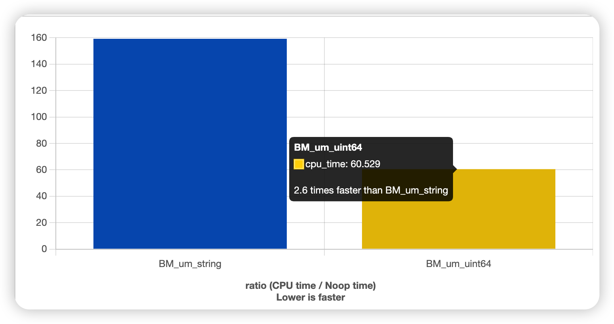

如果你有这样的情景：
- 需要创建一个字典，而字典的key都是很短（长度不超过8）的字符串。
- 同时你又需要追求高性能，希望能达到纳秒级的时延优化。
 
那么你会怎么做呢？

<!-- more -->

很常见的做法是：

```cpp
std::unordered_map<std::string, T> dict;
```

但是其实，我们可以针对这个场合做出神奇的优化：

众所周知，字符串是由字符组成的，而每个字符占1个字节，也就是说相当于一个`int8_t`或者`uint8_t`。
而如果key都不超过8，那么$8 \times 8 = 64$，我们完全可以将其convert为一个`uint64_t`。即

```cpp
std::unordered_map<uint64_t, T> dict;
char str[10];   // strlen(str) <= 8
dict.insert({*reintepret_cast<uint64_t*>(str), _});
```

这么一看你就懂了吧！无须多言。最后我们上个效率对比吧，看看能有多大的提升：



你也可以[在此在线观看这个benchmark](https://quick-bench.com/q/yiUMubp7mDrmwQh4zJVML8q2Pw4)。

此外，你也可以考虑采取其它实现方式的map，比如这里有位大神总结的[Comprehensive C++ Hashmap Benchmarks 2022](https://martin.ankerl.com/2022/08/27/hashmap-bench-01/)，根据你需要的场景，选择更合适的map，也能继续压低时延。