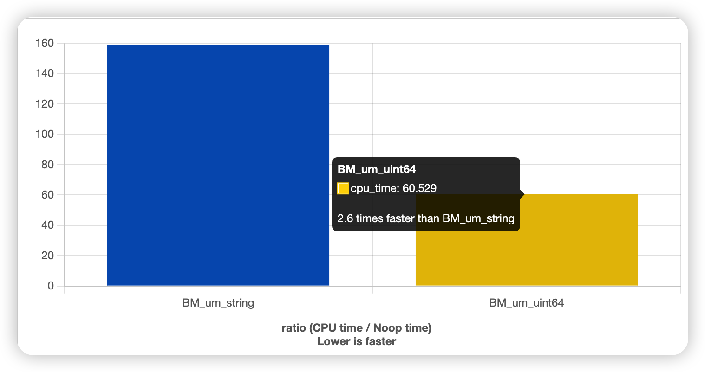

如果你有这样的情景：
- 需要创建一个字典，而字典的key都是很短（长度不超过8）的字符串。
- 同时你又需要追求高性能，希望能达到纳秒级的时延优化。
 
那么你会怎么做呢？

<!-- more -->

很常见的做法是：

```cpp
std::unordered_map<std::string, T> dict;
```

但是其实，我们可以针对这个场合做出神奇的优化：

众所周知，字符串是由字符组成的，而每个字符占1个字节，也就是说相当于一个`int8_t`或者`uint8_t`。
而如果key都不超过8，那么$8 \times 8 = 64$，我们完全可以将其convert为一个`uint64_t`。即

```cpp
std::unordered_map<uint64_t, T> dict;
char str[10];   // strlen(str) <= 8
dict.insert({*reintepret_cast<uint64_t*>(str), _});
```

这么一看你就懂了吧！无须多言。最后我们上个效率对比吧，看看能有多大的提升：



你也可以[在此在线观看这个benchmark](https://quick-bench.com/q/yiUMubp7mDrmwQh4zJVML8q2Pw4)。

## 补充：用 `_mm_crc32_u64` 加速短字符串哈希

上面是把短字符串**直接当作 key**：一次 64 位读取后，就完全绕过了字符串 hash。另一个常见需求是仍然保留 `std::string` 作为 `unordered_map` 的 key（例如已有接口不能改、或者 key 的长度不保证永远不超过 8），但想把「绝大多数只有几个字节」的 hash 算得更快。这时可以用 `_mm_crc32_u64`。

它对应 SSE4.2 的 `CRC32 r64, r/m64` 指令：一次把 8 个字节送进 CRC-32C 状态。对长度不超过 8 的字符串，先把字节安全地复制到一个清零的 `uint64_t`，再执行一次 `_mm_crc32_u64`，最后把长度也累加进去即可。这样避免了逐字节循环，也不会读取字符串边界以外的内存。

```cpp
#include <cassert>
#include <cstddef>
#include <cstdint>
#include <cstring>
#include <string>
#include <string_view>
#include <unordered_map>
#include <nmmintrin.h>  // _mm_crc32_u64 / _mm_crc32_u8

struct short_string_crc32c_hash {
    std::size_t operator()(std::string_view key) const noexcept {
        assert(key.size() <= 8);

        std::uint64_t word = 0;  // 补零，保证不会读过 key 的末尾
        std::memcpy(&word, key.data(), key.size());

        auto crc = static_cast<std::uint32_t>(_mm_crc32_u64(0, word));
        // 把长度放进 hash，避免 "a" 与 "a\\0" 只因补零而得到同一输入。
        crc = _mm_crc32_u8(crc, static_cast<std::uint8_t>(key.size()));
        return crc;
    }
};

std::unordered_map<std::string, T, short_string_crc32c_hash> dict;
```

这段 hash 的关键是 **hash 的输入仍然是字符串本身**，而不是把 CRC 值当作唯一 key。CRC 只有 32 位，必然会碰撞；`unordered_map` 在 hash 相等后还会用 `std::string` 比较原文，所以正确性不受影响。碰撞只会让同一个 bucket 变长。也正因为如此，输入来自不可信用户、需要抵御 hash flooding，或数据规模大到 32 位 hash 碰撞显著时，不应使用它。

编译时 GCC/Clang 需要启用 `-msse4.2`；部署到 CPU 型号不受控的机器时，还要用 `__builtin_cpu_supports("sse4.2")` 做特性分发，并保留普通 hash fallback，否则不支持该指令的 CPU 会触发非法指令。它计算的是 **CRC-32C（Castagnoli）**，不是 `zlib::crc32` 使用的 IEEE CRC-32；[Intel 指令参考](https://www.intel.co.jp/content/dam/www/public/us/en/documents/manuals/64-ia-32-architectures-software-developer-vol-2d-manual.pdf)和 [Clang 的 intrinsic 定义](https://clang.llvm.org/doxygen/crc32intrin_8h_source.html)可供核对。

对于长度超过 8 的字符串，可以按每 8 字节循环调用 `_mm_crc32_u64`，尾部复制到补零的 `uint64_t` 后再处理；但这篇文章的目标场景是短 key，因此上面的单次 64 位读取就是最直接的 fast path。是否比你当前标准库的 `std::hash<std::string>` 更快，仍要以目标编译器、CPU 和真实 key 分布 benchmark 为准。

此外，你也可以考虑采取其它实现方式的map，比如这里有位大神总结的[Comprehensive C++ Hashmap Benchmarks 2022](https://martin.ankerl.com/2022/08/27/hashmap-bench-01/)，根据你需要的场景，选择更合适的map，也能继续压低时延。
