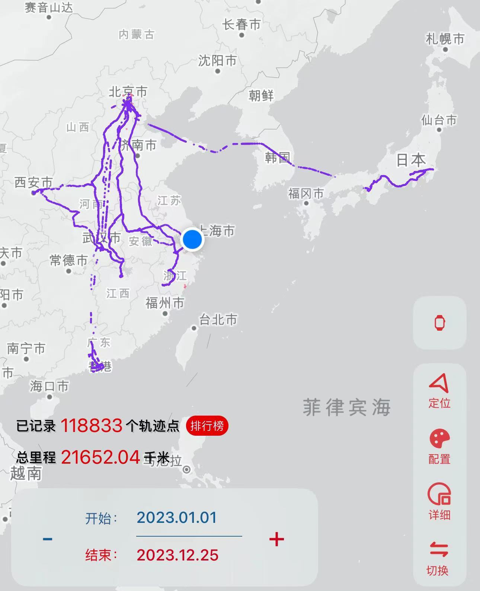

今年是我迄今为止的人生中最为丰富的一年，上半年是我学生时期的终结，而下半年是我社畜时期的初始，因此也是极其特殊的一年。在这一年间里，由于环境限制与经济条件的变化，我终于得以体验之前没法体验的事情了。

<!-- more -->

让我们从上半年开始吧。业已进入大四下的我，去向已经确定，毕业只剩毕业论文，已经没有什么可以害怕的了。而一想到未来成为社畜的我，时间应该是少得可怜，而过去的我也并没有去过多少地方，那么就应该由时间多的现在，最后的学生时期，来到处游玩一番。

于是我就发疯了似的到处跑，靠着绿皮火车和挂壁酒店。图中除了上海部分是下半年的，其他基本都是我上半年跑的。

也是借此，在大学的最后时光里，我才终于体会到一点「大学的青春」的感觉。通过到处访问，我体会了大学之间的差别，制度之间的差别，国内与国外的差别。

在旅途的最后，我还完成了「毕业巡游」的企划——我带着学士服寻访过去，包括小学同学、初中同学、高中同学，然后是最后的大学毕业典礼。听上去是很疯狂的企划，但得益于我的朋友并不多，最终还是大抵跑完了。

---

而下半年我迎来了毕业，开始了独居。相对于宿舍，独居真的是舒服了太多。

在之前找工作的时候，老实说，上海在我的优先级顺位里排得很低，因为互联网大厂基本都在北京、杭州、深圳，但由于運命，最终我还是来到了上海。来了之后我才终于意识到了我之前一直没有考虑的因素——上海的イベント真的是太多了！

对动画漫画音乐游戏爱好者来说，上海可以说是中国内的天堂了，要是说上海是国内第二，那也就只有台北能说是国内第一了。不仅我来的下半年就已经参加了十几个イベント，而且可以预见的是明年第一个季度就有五六个要参加的。可以说是平均每半个月就有一个，实在是太充实了。

而在上半年旅行途中被偶然激发的兴趣下半年也在上海得以充分发酵，歌唱是心灵的绝叫。平时在心中堆压的言语，可以籍此释放。同时它意外地也算一种社交活动，可以稍微弥补这方面的缺失。

哦，对了，上海吃的也比上述的某几个城市多！

---

我不是能写很多文字的人，写到这里基本已经是我现在的极限了。

可以看出，上半年的主线「旅行」，下半年的主线「活动」，两者都是更加现实性的。我在渐渐尝试与网络脱钩，好好地玩地球Online，只希望老天不要再搞我了。

下一站……